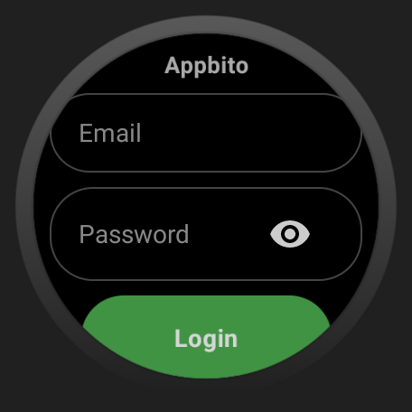
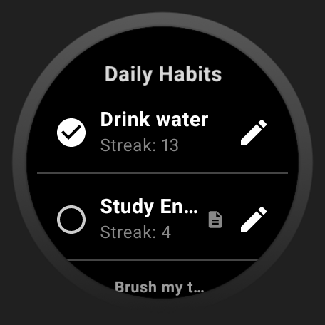
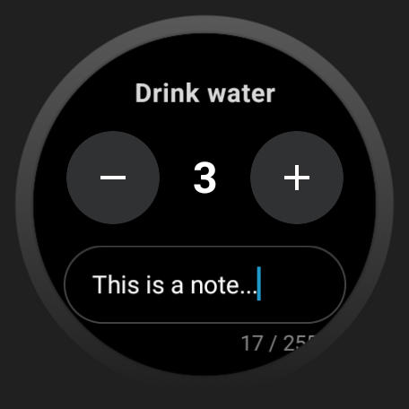

# Appbito Wear OS Client


The smartwatch extension of the Appbito platform. Built specifically for Wear OS devices, this application serves as a lightweight, highly optimized wearable client to interact with the [Appbito Spring Boot API](https://github.com/JozRamirez10/Appbito-Backend). It allows users to quickly log in, check their daily habits, and update their progress directly from their wrist.

> **Note on Project Scope:** While the core business logic, E2E testing, and strict security validations reside within the Spring Boot backend architecture, this Wear OS client focuses heavily on **Clean Code, UI/UX for circular screens, and extreme hardware optimization** (battery conservation and memory management) to deliver a premium native wearable experience.

## 🏗️ Architecture & Tech Stack

*   **Language:** Kotlin
*   **UI Toolkit:** Jetpack Compose for Wear OS
*   **Architecture Pattern:** MVVM (Model-View-ViewModel) with Unidirectional Data Flow (StateFlow)
*   **Networking:** Retrofit2 & Gson
*   **Local Storage:** Preferences DataStore (Secure JWT handling)
*   **Navigation:** Wear Compose Navigation

### ⚡ Engineering & Optimization

Building for Wear OS requires careful resource management. This project focuses on performance and reliability for limited hardware:

*   **Hybrid UI Text Input:** Fixes the known Jetpack Compose keyboard freeze on Galaxy Watches by wrapping the classic Android `EditText` in a custom `AndroidView`, ensuring stable and memory-safe typing.
*   **Battery Optimization:** Uses `Lifecycle.State.STARTED` for state collection, pausing UI updates when the screen sleeps or the app is minimized to conserve battery life.
*   **Smooth Scrolling:** Optimizes `ScalingLazyColumn` with lambda memoization (`remember`) to prevent unnecessary recompositions and maintain fluid list scrolling.
*   **Circular Screen Adjustments:** Disables default list auto-centering and applies custom paddings to maximize screen real estate without clipping text on round bezels.
*   **Reactive Network Monitoring:** Avoids battery-draining network polling by leveraging a `callbackFlow` over the native `ConnectivityManager`. The app passively listens for connection changes and instantly reacts, saving extreme battery life.
*   **Stale State Prevention & Offline Mode:** Enforces strict date-validation on the `Lifecycle.Event.ON_START` to guarantee users never interact with cached data from previous days. It dynamically renders a "Read-Only" offline mode (disabling action buttons) if the connection is lost, fully protecting the backend's data integrity.
---

## 📱 User Interface

Designed exclusively for circular watch faces with a true-black (`#000000`) hardware window background to blend seamlessly with smartwatch bezels and save OLED battery life.

| Login Screen | Daily Habits | Edit Progress |
| :---: | :---: | :---: |
|  |  |  |

---

## 📂 Repository Structure

```text
appbito-wear/
├── app/
│   ├── src/main/java/com/app/appbitowear/
│   │   ├── constants/        # Centralized UI texts, magic strings, and API configs
│   │   ├── data/             # Models (Requests/Responses) & DataStore management
│   │   ├── presentation/     # UI Layer
│   │   │   ├── components/   # Reusable Compose widgets (WearTextField, ActionChip, etc.)
│   │   │   ├── screens/      # Main View definitions (Login, DailyHabits, Profile)
│   │   │   └── viewmodels/   # State management and API communication
│   │   ├── repository/       # Data fetching abstractions (Retrofit DAO)
│   │   └── utils/            # Extension functions and HTTP Error handlers
├── build.gradle.kts          # App-level Gradle (Dependencies & BuildConfig)
├── local.properties          # Ignored file for Secret Environment Variables
└── README.md
```

---

## 🚀 Getting Started

### Prerequisites
*   Android Studio (Koala or newer recommended)
*   Wear OS 3.0+ Emulator or Physical Device (e.g., Galaxy Watch 4/5/6)
*   *Required:* The [Appbito Backend API](https://github.com/JozRamirez10/Appbito-Backend) must be running and accessible.

### Environment Setup (Security First)
To prevent hardcoded production URLs from leaking into version control, this project uses a secure `BuildConfig` injection via `local.properties`.

1. Clone the repository:
   ```bash
   git clone https://github.com/JozRamirez10/Appbito-Wear.git
   cd Appbito-Wear
   ```
2. Open the project in Android Studio.
3. Open (or create) the `local.properties` file in the root directory.
4. Add your API Base URL (enclosed in double quotes):
   ```properties
   BASE_URL="https://your-api-url.com"
   ```
5. **Sync Project with Gradle Files** (Click the elephant icon) and execute a **Rebuild Project** to generate the `BuildConfig` class.

### Installation & Execution
1. Connect your physical Wear OS watch via Wireless Debugging or start a Wear OS Emulator.
2. Select the `app` configuration in Android Studio.
3. Click **Run** (▶️).

---

## 📄 License

This project is licensed under the MIT License. See the [LICENSE](LICENSE) file for details.